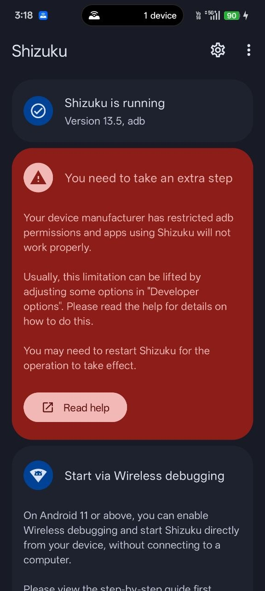
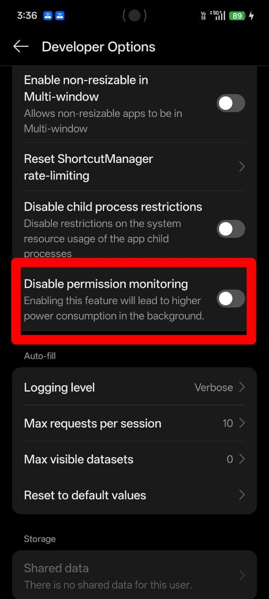
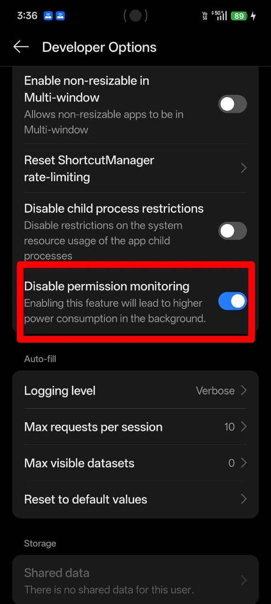
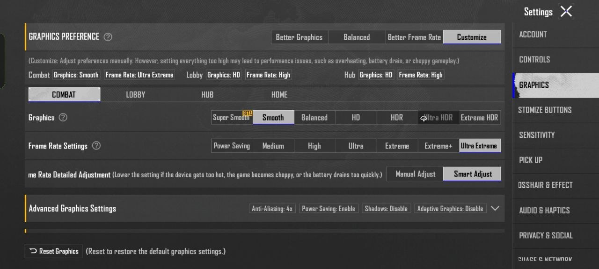

# 🚀 Shizuku Quick Start & ADB Troubleshooting Tool

> 💡 **Why I built this:**
> *I hit the notorious Shizuku "restricted permissions" problem on my phone, so I solved it by creating this script and `.exe` file specifically to make it incredibly easy for non-technical users to fix!*

This tool helps automate the process of starting the Shizuku service over a USB connection without needing to type long ADB commands into the command prompt every time your phone restarts!

## 📦 What is this?
The `ShizukuTool.py` script is a simple, lightweight Windows GUI. It provides two main features:
1. **Check Status**: See if your phone is properly connected via ADB and if the Shizuku service is actively running on the device.
2. **Start / Restart Shizuku**: A one-click button to execute the internal Shizuku starter script directly on your phone.

---

## 🛠️ Requirements & Setup

Before using the tool, ensure your phone is set up correctly for ADB:

1. Connect your phone to your PC via a USB data cable.
2. Ensure **USB Debugging** is turned **ON** in your phone's Developer Options.
3. When you plug it in, ensure you accept the **"Allow USB Debugging?"** prompt on your phone (Check the "Always allow from this computer" box!).

> [!WARNING]
> ### 🛑 CRITICAL STEP FOR REALME, OPPO, & ONEPLUS USERS 🛑
> If you see a **large red warning** inside your Shizuku app ("You need to take an extra step..."):
> 
> 
> 
> **How to fix this:**
> 1. Go to your phone's **Settings > Developer Options**.
> 2. Scroll ALL the way to the very bottom of the page.
> 3. Find **`Disable permission monitoring`**. If it is turned off like this:
> 
> 
> 
> 4. Turn it **ON** (the switch should be blue):
> 
> 
> 
> 5. *(Optional but recommended)*: If you see a setting called **`USB Debugging (Security settings)`**, turn that **ON** as well.
>
> **If you skip this step**, Shizuku will show as "Running" but apps will be permanently denied permission to use it!

---

## 🎮 Bonus: Gaming Graphics Optimization
If you are using this tool to help configure apps for gaming (like BGMI/PUBG), make sure your in-game settings are optimized for the best FPS:

---

## 🏃 Using the Tool

There are two different ways you can use this project, depending on your needs!

### 👉 Method 1: Using the Standalone `.exe` (For Non-Technical Users)
This is the easiest method and requires **zero setup or installation**.
1. Download the `ShizukuTool.exe` file.
2. Ensure that you have downloaded `adb.exe`, `AdbWinApi.dll`, and `AdbWinUsbApi.dll` and placed them in the **exact same folder** as the `.exe`.
3. Simply double-click `ShizukuTool.exe` to open the interface!
4. Click **Check Status** to ensure your phone is communicating properly, then click **Start / Restart Shizuku**!

### 👉 Method 2: Running the Python Source Script (`.py`)
If you are a developer or want to modify the code yourself, you can run the raw Python script:
1. Ensure you have **Python** installed on your Windows PC.
2. Ensure you have Android Platform Tools (ADB) in the same folder or added to your system PATH.
3. Open your terminal or Command Prompt, navigate to the folder, and type:
   `python ShizukuTool.py`
4. The GUI tool will open automatically!

> [!TIP]
> **Important Note:** For both methods, you will need to run the tool again every time you **restart your phone**, because Shizuku is a temporary ADB service that clears when the phone turns off. Keep the tool somewhere easy to find!
